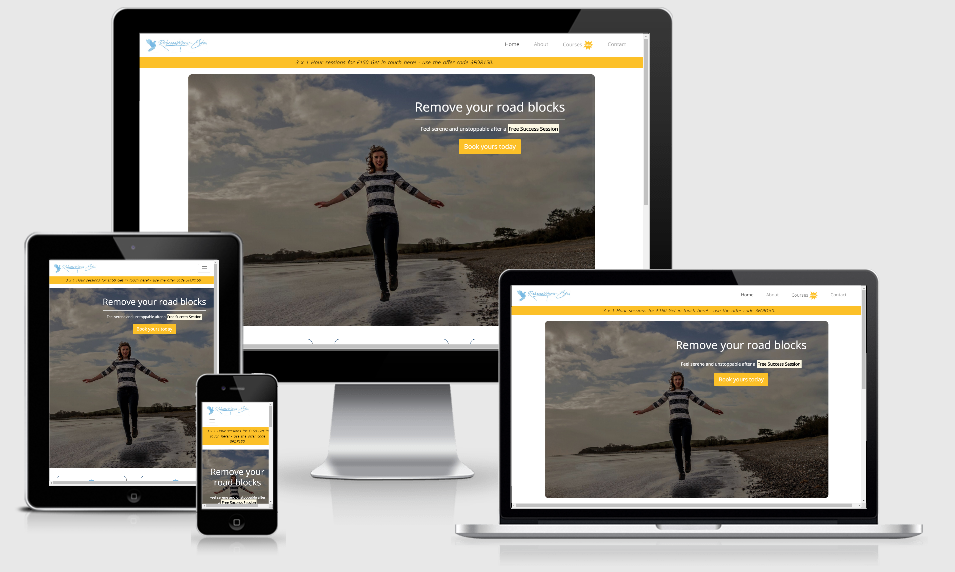

# Rebecca Morris-Eyton

[View the live website here](https://charliemallon.github.io/MilestoneProject1/)

This website aims to increase Rebecca's clients and therefore increase revenue.  I will allow existing and potential clients to find out more about Rebecca and to Book time with her.

<h2 align="center"></h2>

## User Experience (UX)

-   ### User Stories;

    -   #### First Time Visitor Goals

        1. I want to find out more about Rebecca so that I can make an informed decision.  
        2. I want to find out costings so that I work out if I can afford this service.  
        3. I want to find out more about the service provided so that I can make an informed decision.  
        4. I want to book a session with Rebecca so that I can start using her services.  

    -   #### Returning Visitor Goals

        1. I want to find out about any new courses or information 

    -   #### Frequent User Goals

        1. I want to find out about current offers so that I can get free stuff.  

    -   #### Site Owner Goals

        1. I want to show people I am credible so that they trust me.  
        2. I want to give clear information on my services so that my customer knows what they are getting.  
        3. I want to reach out to my customers so that they feel connected.  
        4. I want to share my thoughts and insights so that people continue to come to the site.  

-   ### Design
    -   #### Colour Scheme
        -   The two main colours are blue and white, these were chosen as they tie into the company logo.  Yellow has been used for the alerts due its contrasting nature.
    -   #### Typography
        -   The Open Sans and Roboto are the two main fonts used throughout the whole website with Sans Serif as the fallback font in case for any reason the font isn't being imported into the site correctly. Open Sans is a clear font and is both attractive and appropriate.
    -   #### Imagery
        -   Imagery is important. The large, background hero image is designed to be striking and catch the user's attention. It also has a modern, energetic aesthetic.

-   ### Wireframe

    -   Initial Wireframe Designs - [View](..assets/wireframes/wireframe_ideas.pdf)

    -   Agreed Wireframe Designs - [View](..assets/wireframes/wireframe_final.pdf)
    

### Competitor Reviews;

 -  [**Tish Hawkins**](https://www.tishhawken.com/)

        | **Pros**       | **Cons**            |
        | -------------  |:-------------------:|
        | Simple design  | Very Wordy          |
        | Consistent     | To much Content     |
        | Good branding  | not very up to date |

    -   Its missing 
        -  A Hook, something that makes you want to stay.

    -   It could do better 
        -   Responsive design. It looks more cluttered The smaller the screen.

-   [**Michell Stonhill**](https://www.michellestonhill.com/) 

        | **Pros**                      | **Cons**              |
        | ----------------------------  |:---------------------:|
        | Simple, Clean design          | Designed for desktops |
        | Easily digestible information | A lot of information  |
        | Lots of clickable links       |                       |

    -   Its missing 
        - Updates - there is no 'new' content

    -   It could do better 
        - Doesn't work well on the phone, there is too much content.

## Features

-   The site is designed to be responsive across all device sizes and screens.
-   Interactive elements

## Technologies Used

-   ### Languages Used

    -   [HTML5](https://en.wikipedia.org/wiki/HTML5)
    -   [CSS3](https://en.wikipedia.org/wiki/Cascading_Style_Sheets)

-   ### Frameworks, Libraries & Programs Used

    1. [AmIResponsive:](http://ami.responsivedesign.is/)
        -   This project uses Am I Responsive for a layout of how the project will look across various devices.
    2. [Bootstrap 4.4.1:](https://getbootstrap.com/docs/4.4/getting-started/introduction/)
        -   Bootstrap was used to assist with the responsiveness and styling of the website.
    3. [Google Fonts:](https://fonts.google.com/)
        -   Google fonts were used to import the 'Open Sans' and 'Roboto' fonts into the style.css file which is used on all pages throughout the project.
    4. [Font Awesome:](https://fontawesome.com/)
        -   Font Awesome was used on all pages throughout the website to add icons for aesthetic and UX purposes.
    5. [jQuery:](https://jquery.com/)
       -   jQuery came with Bootstrap to make the navbar responsive.
    6. [Git](https://git-scm.com/)
        -   Git was used for version control by utilizing the Gitpod terminal to commit to Git and Push to GitHub.
    7. [GitHub:](https://github.com/)
        -   GitHub is used to store the projects code after being pushed from Git.
    8. [Balsamiq:](https://balsamiq.com/)
        -   Balsamiq was used to create the [wireframes](https://github.com/) during the design process.

## Testing

The W3C Markup Validator and W3C CSS Validator Services were used to validate every page of the project to ensure there were no syntax errors in the project.

-   [W3C Markup Validator](https://validator.w3.org/#validate_by_uri) - [Results]()
-   [W3C CSS Validator](https://jigsaw.w3.org/css-validator/#validate_by_input) - [Results]()

### Testing User Stories from User Experience (UX) Section

-   #### First Time Visitor Goals

    1. I want to find out more about Rebecca so that I can make an informed decision.
        1. Where this information is.
        2. What happens if they click something.
    2. I want to find out costings so that I work out if I can afford this service.  
    3. I want to find out more about the service provided so that I can make an informed decision.  
    4. I want to book a session with Rebecca so that I can start using her services.  

-   #### Returning Visitor Goals

    1. I want to find out about any new courses or information 

-   #### Frequent User Goals

    1. I want to find out about current offers so that I can get free stuff.  

-   #### Site Owner Goals

    1. I want to show people I am credible so that they trust me.  
    2. I want to give clear information on my services so that my customer knows what they are getting.  
    3. I want to reach out to my customers so that they feel connected.  
    4. I want to share my thoughts and insights so that people continue to come to the site.  

### Further Testing

-   The Website was tested on Google Chrome, Internet Explorer, Microsoft Edge and Safari browsers.
-   The website was viewed on a variety of devices such as Desktop, Laptop, iPhone11, & iPad.
-   A large amount of testing was done to ensure that all pages were linking correctly.
-   Friends and family members were asked to review the site and documentation to point out any bugs and/or user experience issues.

### Known Bugs

    No current known bugs.

-   Short description.
    -   Result of bug

## Deployment

### GitHub Pages
The project was deployed to GitHub Pages using the following steps...

1. Log in to GitHub and locate the [GitHub Repository](https://github.com/CharlieMallon/MilestoneProject1)
2. At the top of the Repository (not top of page), locate the "Settings" Button on the menu.
    - Alternatively Click [Here](https://raw.githubusercontent.com/) for a GIF demonstrating the process starting from Step 2.
3. Scroll down the Settings page until you locate the "GitHub Pages" Section.
4. Under "Source", click the dropdown called "None" and select "Master Branch".
5. The page will automatically refresh.
6. Scroll back down through the page to locate the now published site [link](https://github.com) in the "GitHub Pages" section.

### Forking the GitHub Repository

By forking the GitHub Repository you make a copy of the original repository on your GitHub account to view and/or make changes without affecting the original repository by using the following steps...

1. Log in to GitHub and locate the [GitHub Repository](https://github.com/CharlieMallon/MilestoneProject1)
2. At the top of the Repository (not top of page) just above the "Settings" Button on the menu, locate the "Fork" Button.
3. You should now have a copy of the original repository in your GitHub account.

### Making a Local Clone

1. Log in to GitHub and locate the [GitHub Repository](https://github.com/CharlieMallon/MilestoneProject1)
2. Under the repository name, click "Clone or download".
3. To clone the repository using HTTPS, under "Clone with HTTPS", copy the link.
4. Open Git Bash
5. Change the current working directory to the location where you want the cloned directory to be made.
6. Type `git clone`, and then paste the URL you copied in Step 3.

```
$ git clone https://github.com/YOUR-USERNAME/YOUR-REPOSITORY
```

7. Press Enter. Your local clone will be created.

```
$ git clone https://github.com/YOUR-USERNAME/YOUR-REPOSITORY
> Cloning into `CI-Clone`...
> remote: Counting objects: 10, done.
> remote: Compressing objects: 100% (8/8), done.
> remove: Total 10 (delta 1), reused 10 (delta 1)
> Unpacking objects: 100% (10/10), done.
```

Click [Here](https://help.github.com/en/github/creating-cloning-and-archiving-repositories/cloning-a-repository#cloning-a-repository-to-github-desktop) to retrieve pictures for some of the buttons and more detailed explanations of the above process.

## Credits

### Code

-   TThe full-screen hero image code came from this [lesson](Insert lesson) - I moved the image out of the background for ease of changing it in future.

-   The Review section  code came from this [lesson](Insert lesson) - I modified it so that it worked with the bootstrap/FlexBox instead of 'float'

-   The why work with me (on the about page) code came from this [lesson](Insert lesson) - I modified it so that it worked with the bootstrap/FlexBox instead of 'float'

-   The contact form was modified from the [lesson](Insert lesson)

-   [Bootstrap4](https://getbootstrap.com/docs/4.4/getting-started/introduction/): Bootstrap Library used throughout the project mainly to make site responsive using the Bootstrap Grid System.

### Content

-   All content was written by the developer and Rebecca (who the site has been designed for).

-   ReadMe content based on [Sample README](https://github.com/Code-Institute-Solutions/SampleREADME)

### Media

-   All large Images were taken by [Gillian Devine](https://www.gilliandevinebrandphotography.com/?fbclid=IwAR0Hw6hfMOdDDLPhoXJbFPF_EfyCBSzglwtb6b10fZxGkI6QCN5Cb1HT59Y) and used with permission of the owner Rebecca Morris-Eyton.
-   Images used in the review section are taken from the [Code Institute course](Insert lesson).

### Acknowledgements

-   Bim for his support and encouragement.

-   My Mentor for helpful feedback.

-   Tutor support at Code Institute for their support.